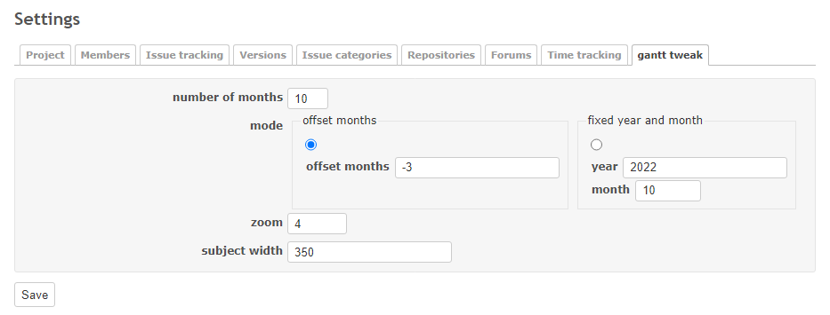
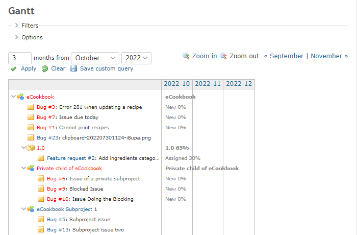
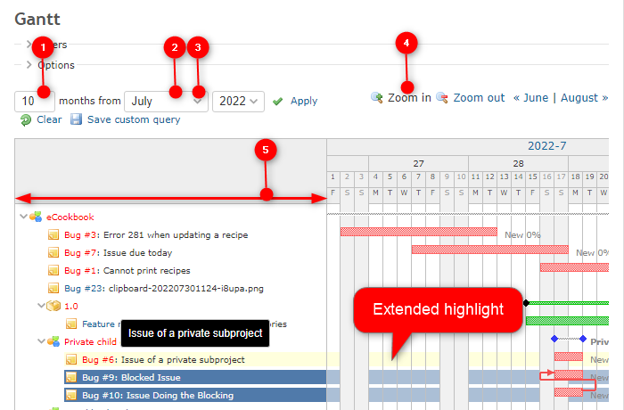

# Redmine Gantt Tweak Plugin
This is a plugin for Redmine.
You can tweak the default parameters of the Gantt chart.
It also includes small improvements for the Gantt chart.


# Features
- Allows setting of default parameters for the Gantt chart for each project.
- Add settings panel in plugin settings and each project settings.
- Extend background highlight of the Gantt chart when mouseover and clicked.
- Display tooltip near the mouse cursor
- Add title to selected column items


# Supported tweakable parameters
1. Number of month to display
2. Number of offset months based on current month
3. Specify year and month
4. Zoom level
5. Subject width


# Installing
## 1. Download
If using Git:
```shell
cd $REDMINE_ROOT/plugins
git clone https://www.github.com/sk-ys/redmine_gantt_tweak
```

If not using Git:
1. Download the zip file from this [link](https://github.com/sk-ys/redmine_gantt_tweak/archive/refs/heads/main.zip).
2. Unzip to the `$REDMINE_ROOT/plugins` directory and rename the directory to `redmine_gantt_tweak`.

## 2. Restart your Redmine


# Images
## Project settings


## Default Gantt chart sample


## Gantt chart after tweaked


# Requirements
- Redmine >= 5.0
- (Not tested on previous versions)
